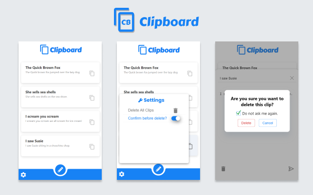

## ***Clipboard***

  

  <b>Clipboard</b> is a simple <i>chromium extension tool</i> for copy pasting small text snippets.

Clipboard lets you add small text snippets, which can be easily copied to the clipboard whenever required. This tool was mainly built to be used as a simple way to store snippets of text that need to be used several times while performing tasks such as coding or testing a website, filling forms and other such tasks.

Try [Clipboard](https://chrome.google.com/webstore/detail/clipboard/ondledijeilehmgddddcgpkjijjbfknb)

  

